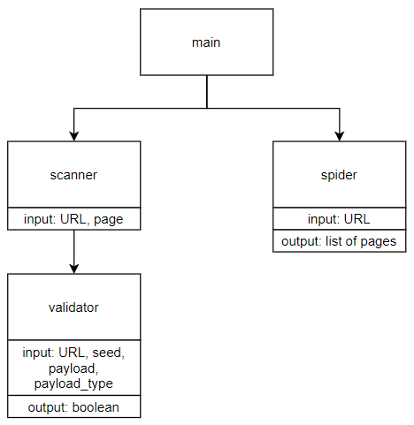

# XsScanner
Бот для автоматического выявления хранимых XSS.

## Установка и запуск
Перед запуском необходимо настроить всё для работы с Selenium и, возможно, сделать некоторые изменения в файле `validator.py` (изменить `firefox_path` на своё значение)  
`pip3 install -r requirements.txt`  
`python3 webapp/main.py`  
`python3 main.py`

## Схема работы
В файле main.py происходит передача URL, который необходимо проверить на наличие уязвимостей. 
Затем бот попытается автоматически найти страницы, доступные с этого URL.
После нахождения всех страниц, бот проходит по ним и ищет формы для отправки данных с последующей отправкой в эти формы нагрузки с уникальными значениями, по которым затем валидируется успех атаки.

## Внедрение в CI и планы по улучшению
* Необходимо упаковать сканер в docker контейнер и прогонять на тестовом стенде при каждом перезапуске сервиса.
* Раскидать все модули по классам вместо функций, улучшить логику поиска и валидации уязвимостей, добавить варианты поиска других типов XSS уязвимостей. 
* Запускать браузер для валидации один раз, и переключаться на новые окна - сэкономит кучу времени
* Сделать больше user-friendly фич
